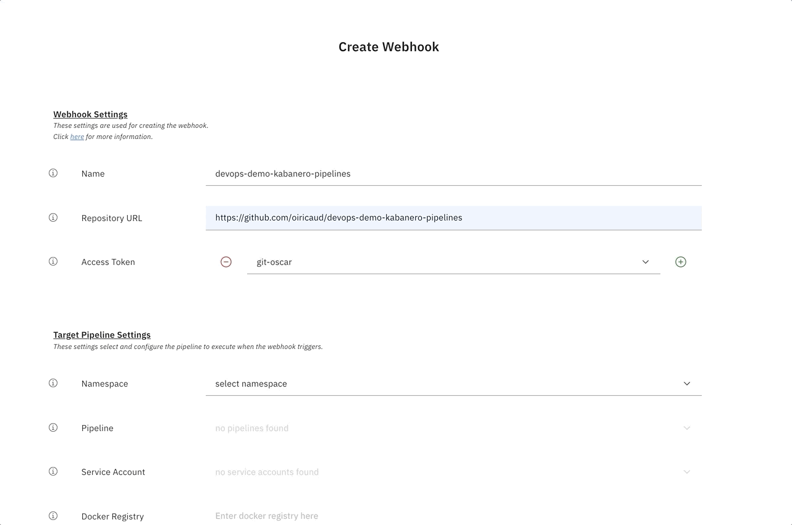

## Table of Contents
  * [Introduction](#introduction)
  * [Pre-requisites](#pre-requisites)
  * [Deploy pipelines on Artifactory](#deploy-pipelines-on-artifactory)
  * [Deploy pipelines on Git Manually](#deploy-pipelines-on-git-manually)
  * [Deploy pipelines on Git Automated](#deploy-pipelines-on-git-automated)
  * [Deploy pipelines without version control](#deploy-pipelines-without-version-control)
# Introduction
This repository includes 3 directories, `experimental`(pipelines that are not production-ready and are considered,
proof of concept),`incubator`(pipelines that are not production-ready and require further development to satisfy the stable criteria.) 
and `stable`(pipelines that are production ready).

This repository also contains multiple pipelines such as [artifactory-package-release-update](pipelines/experimental/artifactory-package-release-update), 
[git-package-release-update](./pipelines/experimental/git-package-release-update) and [mcm-pipelines](pipelines/incubator/mcm-pipelines).
You can view all [/pipelines/](./pipelines/incubator). The repository also contains a [./run.sh](./run.sh) script file which helps automate the process of deploying your pipelines on git.

There are multiple approaches on packaging and releasing your pipelines. Both the `artifactory-package-release-update` & `git-package-release-update` pipelines do the same thing, package, manage
and deploy your custom pipelines, except in different environments. For example, the `artifactory-package-release-update` pipeline, packages your
 pipelines and deploys them onto Artifactory, where as the `git-package-release-update` are deployed as git releases.

The `mcm-pipelines` contains the tasks of building, testing, pushing an image and a healthcheck of a nodejs application. It also
does a `sonar-scan` for code coverage.

# Pre-requisites
* Install the following CLI's on your laptop/workstation:

    + [`docker cli`](https://docs.docker.com/docker-for-mac/install/)
    + [`git cli`](https://git-scm.com/downloads)
    + [`oc cli`](https://docs.openshift.com/container-platform/4.3/welcome/index.html)
    + [`Openshift 4.3.5 with CloudPak for Apps`](https://www.ibm.com/cloud/cloud-pak-for-applications)
    + [`tekton cli`](https://github.com/tektoncd/cli)
    
# Deploy pipelines on Artifactory
### Pre-reqs
You need to deploy [Artifactory](https://github.com/ibm-cloud-architecture/gse-devops/tree/master/cloudpak-for-integration-tekton-pipelines#artifactory) on your openshift cluster

You need to generate an [API Key](https://www.jfrog.com/confluence/display/JFROG/User+Profile). Then you need to go to
[artifactory-config.yaml](configmaps/artifactory-config.yaml) and update the `artifactory_key`. Once done, run the following
commands:

```bash
oc project kabanero
oc apply -f artifactory-config.yaml
```

Then go to [pipelines](pipelines) make any modifications you want to do to any of the pipelines, or include your own.
If you do include your pipelines, use the [skeleton](pipelines/skeleton) to add your modified pipelines, tasks,
bindings, and templates.


# Deploy pipelines on Git (Manually)

# Deploy pipelines on Git (Automated)
### Pre-reqs
You need to create a github 
[token](https://help.github.com/en/github/authenticating-to-github/creating-a-personal-access-token-for-the-command-line)
and need to create a `.gitconfig` file such as:
    
```bash
~/Documents/devops-demo-kabanero-pipelines/ cat ~/.gitconfig

[user]
      name = firstname.lastname
      email = your-github-email@email.com
[github]
      token = your-token
```
    

You need to fork this repo and clone via https.
    
```bash
git clone https://github.com/ibm-cloud-architecture/devops-demo-kabanero-pipelines 
cd devops-demo-kabanero-pipelines
```
You need another repository to host your pipelines. i.e [pipelines-server](https://github.com/oiricaud/pipeline-server/releases) to create git-releases.
  
``` bash
mkdir pipeline-server
cd pipeline-server
git init 
cat >> README.md
    Hello this is my pipeline-server repo press (ctrl+d to save)
git add README.md
git commit -m "added README.md"
git push
```

Now is the time to make any changes you wish to make, or you can use the custom pipelines we have provided for you.


[](https://asciinema.org/a/315675)

# Create a tekton webhook 
### Pre-reqs
You need to create an access token on the tekton dashboard or cli in the kabanero namespace.
Earlier you created a github token on the github dashboard. You will need to get that token or generate another one and 
paste it below.


Webhook Settings:

        Name: devops-demo-kabanero-pipelines
        Repistory-url: your forked repo url goes here
        Access Token: Token you generated previously 

Target Pipeline Settings
        
        Namespace: kabanero
        Pipeline: Choose artifactory-package-release-update-pl or git-package-release-update-pl
        Service Account: Pipeline
        Docker Registry: us.icr.io/project-name or docker.hub.io/projectname
        

# Deploy pipelines without Version Control 
You can but not recommended non-version control your pipelines by running the following command

``` bash
oc apply --recursive --filename pipelines/{pick expiermental, incubator or stable}
```

